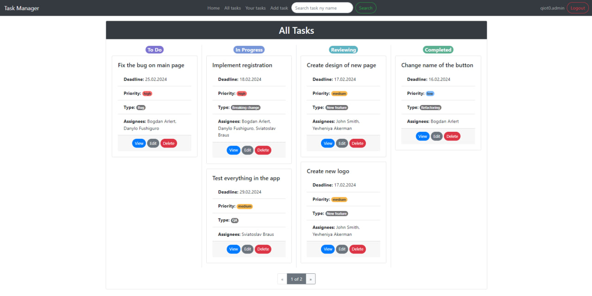

# IT Company Task Manager

Django project for managing tasks in IT company. It helps you handle all 
working process in your team

## Check it out!

[Task Manager deployed to Render](https://task-manager-b721.onrender.com/)

### Test user:
- login: user
- password: user12345

## Installation

Python3 must be already installed

```shell
git clone https://github.com/DanSheremeta/task-manager.git
cd task-manager
python -m venv venv
source venv/bin/activate
pip install -r requirements.txt
python manage.py makemigrations
python manage.py migrate
python manage.py runserver # starts Django Server
```

Then you can open it locally by this url http://127.0.0.1:8000/

## Features

* Login, sign-up and logout functionality for Worker/User
* Managing tasks directly from website interface
* Powerful admin panel for advanced managing

## Demo


